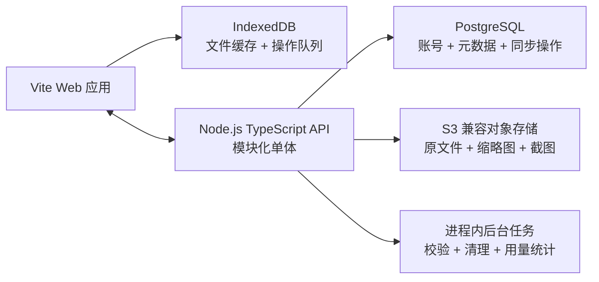

# PaperLingo 离线优先云端存储设计

## 状态

已确认，2026-08-20。

## 目标

PaperLingo 必须在刷新、关闭浏览器或断网后仍能重新打开已上传的 PDF、Word 和图片并继续书写；联网后自动同步到服务器，使同一账号可以在其他设备打开。首个服务器版本支持邮箱密码账号，资料全部私有，并为后续容量套餐和付费系统预留数据结构。

## 约束与范围

- 保留现有 Vite 前端和文档渲染适配器。
- 采用厂商无关技术：PostgreSQL、S3 兼容对象存储，本地使用 MinIO。
- 首版不做分享链接、多人协作、实时协同或微服务。
- 离线编辑必须优先于云端可用性；同步失败不能阻塞书写。
- 原文件、笔迹、图层、书摘、错题和大纲均以稳定 UUID 关联，禁止继续使用文件名作为主键。

## 高层架构

前端通过 `DocumentRepository` 访问资料，不直接依赖 IndexedDB 或 HTTP。仓储先返回本地记录，再由同步服务补齐远端状态。API 使用模块化单体，模块边界为 auth、documents、sync、mistakes、usage；初期共用一个部署单元和一个 PostgreSQL 数据库。

## 数据模型

核心表包括：

- `users`：邮箱、Argon2id 密码哈希、验证状态、账号状态。
- `sessions`：刷新令牌哈希、设备、过期时间和撤销时间。
- `devices`：设备 UUID、显示名称和最后活跃时间。
- `documents`：所有者、标题、类型、页数、版本、同步状态和软删除时间。
- `document_objects`：对象存储键、用途、MIME、大小、SHA-256 和上传状态。
- `layers`：文档内用户管理的图层及顺序。
- `annotation_ops`：不可变笔迹操作，含操作 UUID、设备序号和文档版本。
- `excerpts`、`outlines`：书摘、大纲及来源页。
- `mistake_books`、`mistake_entries`：跨文件错题组织与来源信息。
- `sync_cursors`：设备对各文档已消费的服务端操作序号。
- `plans`、`subscriptions`、`usage_records`：套餐、订阅状态和存储用量；首版不接支付渠道。

所有业务表必须包含 `user_id` 或通过父记录验证所有权。数据库外键保证结构完整性，JSONB 仅用于笔迹负载和可扩展参数，不替代核心关系字段。

## 文件上传与打开

1. 浏览器生成 `documentId`，把原文件 Blob 和元数据写入 IndexedDB，状态为 `local-only`。
2. 登录后创建上传会话，API 检查容量和文件类型，返回短期签名上传地址。
3. 浏览器将 Blob 直接上传到 S3 兼容存储；失败时保留本地文件和重试信息。
4. 浏览器提交文件大小和 SHA-256；API 校验对象后将记录标记为 `synced`。
5. 其他设备先获取元数据，再按需下载并缓存到 IndexedDB。打开文件优先读取本地 Blob。

上传确认必须幂等。只有 API 完成对象校验后，界面才显示“已同步”。未完成或孤立对象由后台任务定期清理。

## 离线同步

每次笔迹、图层、大纲、书摘或错题变更先写入 IndexedDB 的 `operations` 队列。操作包含 `operationId`、`documentId`、`deviceId`、`deviceSequence`、`baseVersion`、类型和负载。服务器以 `(user_id, operation_id)` 唯一约束去重，并为接受的操作分配递增服务端序号。

笔迹类操作按追加、删除和变换合并。标题等单值字段使用乐观并发控制；版本冲突时返回当前值，不静默覆盖。客户端完成拉取后更新同步游标，失败采用带抖动的指数退避。登出不清除本地缓存，但会移除令牌并锁定云端同步；其他账号不能认领现有本地资料，必须显式选择迁移。

## 认证与安全

- 邮箱统一小写并建立唯一索引。
- 密码使用 Argon2id；访问令牌短期有效且只保存在内存。
- 刷新令牌仅存于 `HttpOnly`、`Secure`、`SameSite` Cookie，数据库只保存令牌哈希。
- 登录、注册和上传会话均限流；错误信息不泄露邮箱是否存在。
- 文件对象默认私有，只能通过短期签名下载地址读取。
- API 每次访问同时验证登录用户与资源所有权。
- 日志禁止记录密码、令牌、签名地址和文件正文。

## 故障与恢复

| 故障 | 用户影响 | 处理方式 |
|---|---|---|
| 断网或 API 不可用 | 云端状态延迟 | 本地继续编辑，队列自动重试 |
| 对象存储不可用 | 新文件暂不能同步 | 保留 IndexedDB Blob，不提交远端完成状态 |
| 重复请求 | 可能重复数据 | 操作 UUID、上传会话和提交接口全部幂等 |
| 数据库不可用 | 登录与同步暂停 | 本地编辑继续；恢复后重放队列 |
| 文件损坏 | 其他设备无法打开 | SHA-256 与大小校验，保留本地副本并提示重传 |
| 误删除 | 资料暂时隐藏 | 软删除和恢复期；对象延迟清理 |

PostgreSQL 定期备份，对象存储启用版本或延迟删除策略。首版目标 RPO 为 24 小时、RTO 为 4 小时。

## 非功能目标

- 已缓存资料断网时可打开和书写。
- 恢复联网后自动同步，不阻塞编辑。
- 普通 API 请求 p95 小于 300ms，不含大文件传输。
- 文件传输支持进度、取消和失败续传；具体分片阈值由实施测试确定。
- 容量、单文件大小和上传频率均可按套餐配置。
- 首版部署采用 Docker Compose；生产可分别替换数据库和对象存储。

## 测试策略

- 单元测试：IndexedDB 仓储、操作去重、版本冲突、容量计算和认证校验。
- 集成测试：真实 PostgreSQL 与 MinIO 的上传、提交、下载和权限隔离。
- 端到端测试：离线上传、登录迁移、恢复同步、另一设备打开并继续书写。
- 故障测试：上传中断、API 超时、重复提交、损坏对象、过期签名地址和数据库恢复。
- 安全测试：越权访问、弱密码、暴力登录、令牌重放和文件类型伪造。

## 暂不实现

分享链接、团队空间、实时协作、支付渠道、Redis、消息队列、全文搜索和多区域部署均不进入首版。

